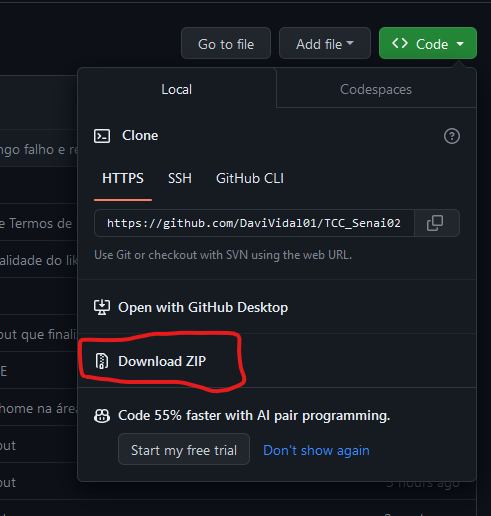
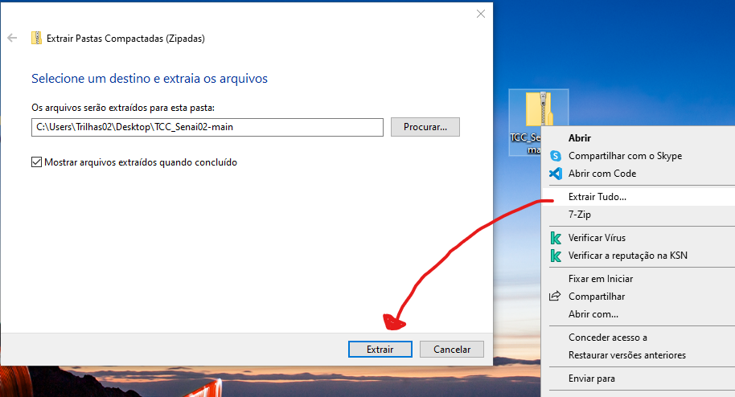
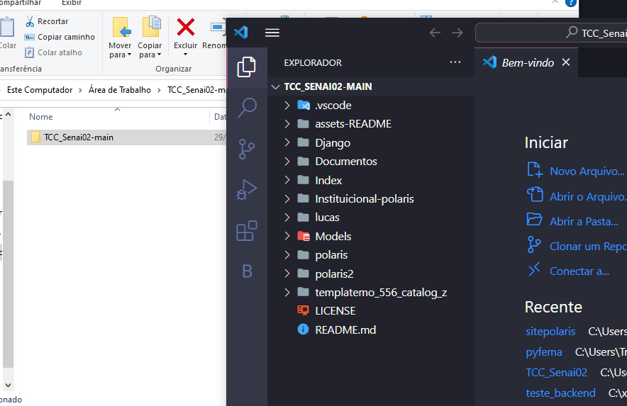
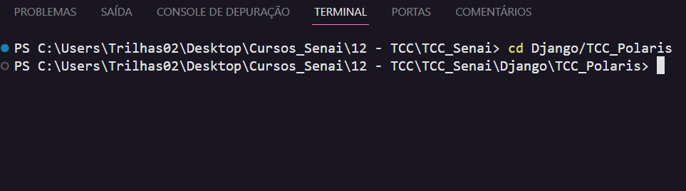
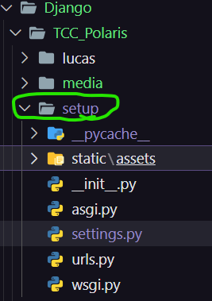
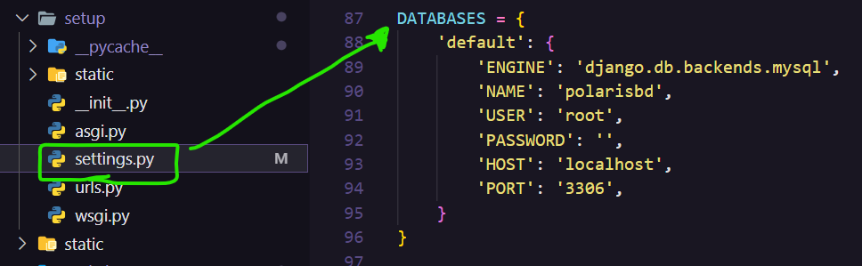

<p align="center">
  
</p>


## High Fashion - Transformando Estilo em Experiência Online

Bem-vindo ao futuro da moda digital, onde a elegância encontra a inovação. A High Fashion é mais do que uma marca, é uma experiência de estilo que transcende o comum. Fundada em 1972 por visionários apaixonados pela moda, a empresa rapidamente se tornou sinônimo de sofisticação e tendências avant-garde.

### 📖 Um pouco da história:
Estabelecida em São João Nepomuceno, 25/02/1972, a empresa " High Fashion Confecções ltda." foi fundada por Gianni Givenchy e Yves Dior atuando principalmente na moda adulta feminina utlizando-se dos conceitos
de criar roupas práticas, confortáveis e que trouxessem consigo uma beleza cotidiana.
Iniciando com poucas máquinas, mas com muitas ideias e critavidade, a empresa se destacou no mercado e consequentemente expandiu seu parque fabril agregando máquinas de última geração, automação de processos e 
utilização de softwares de design, criação e densenvolvimento.

E como última ação de marketing e agilidade dos processos, a "High Fashion" lançou um site instituicional, que além de apresentar a empresa para o mundo, também trará aritgos e dicas de moda,um canal de contato contato direto e uma funcionalidade de controle e gerenciamento de fichas técnicas.

🗃️ - **Recursos Principais:**
- **Navegação Intuitiva:** Explore nossas coleções de forma fácil e envolvente.
- **Lookbook Virtual:** Inspire-se com nossas sugestões de combinações e tendências.


### 👀 Transformando Visão em Realidade - Polaris Softwares

Este site foi cuidadosamente projetado e desenvolvido pela equipe dedicada da Polaris Softwares, uma empresa líder em soluções digitais. Se você também busca inovação e excelência para a sua presença online, confie na Polaris Softwares para transformar a sua visão em realidade.

**Produzido por: Polaris Softwares** <br>
**Saiba mais:**
[ Site ](https://polarissoftwares.github.io/site/)&nbsp;&nbsp;[ Perfil do github ](https://github.com/polarissoftwares)

Descubra a fusão perfeita entre moda e tecnologia. Seja bem-vindo ao futuro da High Fashion.
## 📚 Build 

> ⚠️ **Requisitos:** *Python v3.12.0*, *Django v4.2.6*, *XAMPP v3.3.0*, *MySQL*, *Pip 23.3.1*

🏃 - **Passo a Passo:**

- Você começará baixando o arquivo compactado do site:



- Depois irá "Extrair arquivos" da pasta compactada:



- Abra o VSCode na pasta "TCC_Senai02-main"



- Abra o terminal e use o comando:



```bash
cd ./Django/TCC_Polaris
```

- 🔔 Certifique-se de que o Python e Pip estejam instalados no seu sistema. Você pode verificar isso executando o seguinte comando no seu terminal ou prompt de comando:

```bash
python --version
```

```bash
pip --version
```

> Caso contrário, você pode baixa-los em seus sites e seguirem as instruções de instalação em [Python](https://www.python.org/downloads/) e [Pip](https://pip.pypa.io/en/stable/installation/)
>> Pip (Python Package Installer) geralmente é incluído na instalação do Python mais recente.

- Extraia os requerimentos necessarios para a execução do projeto:

```bash
 pip install -r requeriments.txt
```

- Agora vá dentro do projeto do diretório chamado "TCC_Polaris" e procure pelo diretório "setup":

  

- Depois você selecionará o arquivo "settings.py" e na seção de DATABASE, você irá colocar as configurações do seu servidor MySQL:

 

  
- Agora realize os comandos no terminal para poder receber a conexão com o Banco de Dados:
  
```bash
python ./manage.py makemigrations
```

```bash
python ./manage.py migrate
```

- Realize o comando para receber os arquivos staticos e concorde com "yes":

```bash
python ./manage.py collectstatic
```

- Depois de tudo estar em ordem, realize o comando para iniciar o servidor:

```bash
python ./manage.py runserver
```
---          

