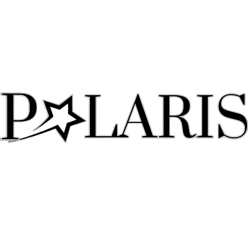

<!DOCTYPE html>
<html>
    <head>
        <meta charset="UTF-8">
    </head>
    <body>
        <h1>TCC SENAI ( Polaris ) Album de Fotos 📚</h1>
        
        <h2>● Sobre o Projeto 🗃️</h2>
          <list>
            <ul>
              Este projeto foi concebido e desenvolvido de forma colaborativa por um grupo de cinco estudantes denominado 'Polaris'. Nosso trabalho resultou na construção de um site avaliativo de fotos, uma plataforma que visa proporcionar uma experiência única para os entusiastas da fotografia e os apaixonados por imagens.
            </ul>
            <ul>
              - <strong>Comentários Moderados</strong>: Implementamos um sistema de comentários onde somente os moderadores que adicionaram as fotos podem visualizar e gerenciar os comentários. Isso permite um controle mais eficiente e personalizado das discussões em torno das imagens.
            </ul>
          </list>
        <h2>● Contribuidores 👥</h2>
        <table align="center" style="justify-content:center;">
          <tr>
            <td align="center"><a href="https://github.com/DaviVidal01"> <b>DaviVidal01</b></a> <a href="https://github.com/DaviVidal01/TCC_Senai/commits?author=DaviVidal01">🎩<strong>Frontend e Backend</strong></a></td>
            <td align="center"><a href="https://github.com/lferodrigues"> <b>lferodrigues</b></a> <a href="https://github.com/DaviVidal01/TCC_Senai/commits?author=lferodrigues">🚀<strong>Documentação e BD</strong></a></td>
            <td align="center"><a href="https://github.com/luquinha157"> <b>luquinha157</b></a> <a href="https://github.com/DaviVidal01/TCC_Senai/commits?author=luquinha157">💻<strong>Frontend e BD</strong></a></td>
            <td align="center"><a href="https://github.com/GiselliR"> <b>GiselliR</b></a> <a href="https://github.com/DaviVidal01/TCC_Senai/commits?author=GiselliR">🎨<strong>Backend</strong></a></td>
            <td align="center"><a href="https://github.com/Lucianojr11"> <b>Lucianojr11</b></a> <a href="https://github.com/DaviVidal01/TCC_Senai/commits?author=GiselliR">🎨<strong>Backend</strong></a></td>
            <td align="center"><a href="https://github.com/NathaliaFT"> <b>NathaliaFT</b></a> <a href="https://github.com/DaviVidal01/TCC_Senai/commits?author=GiselliR">🎨<strong>Frontend</strong></a></td>
            <td align="center"><a href="https://github.com/Luisrenatou"> <b>Luisrenatou</b></a> <a href="https://github.com/DaviVidal01/TCC_Senai/commits?author=GiselliR">🎨<strong>Designer</strong></a></td>
          </tr>
        </table>
        <h2>● Programas 📚</h2>
        <table>
          <tr>
            <td align="center"> <strong>HTML5</strong></td>
            <td align="center"> <strong>CSS3</strong></td>
            <td align="center"> <strong>Python</strong></td>
          </tr>
        </table>
        <h2>● Frameworks 🤖</h2>
        <table>
          <tr>
            <td align="center"> <strong>BootstrapV5.3</strong></td>
            <td align="center"> <strong>Django</strong></td>
          </tr>
        </table>
        <h2>● Banco de Dados 🗃️</h2>
        <table>
          <tr>
            <td align="center"> <strong>MySQL</strong></td>
          </tr>
        </table>
        <h2>● Imagens do Projeto 📖</h2>
        

            
             
            
 
            
        

    </body>
</html>
